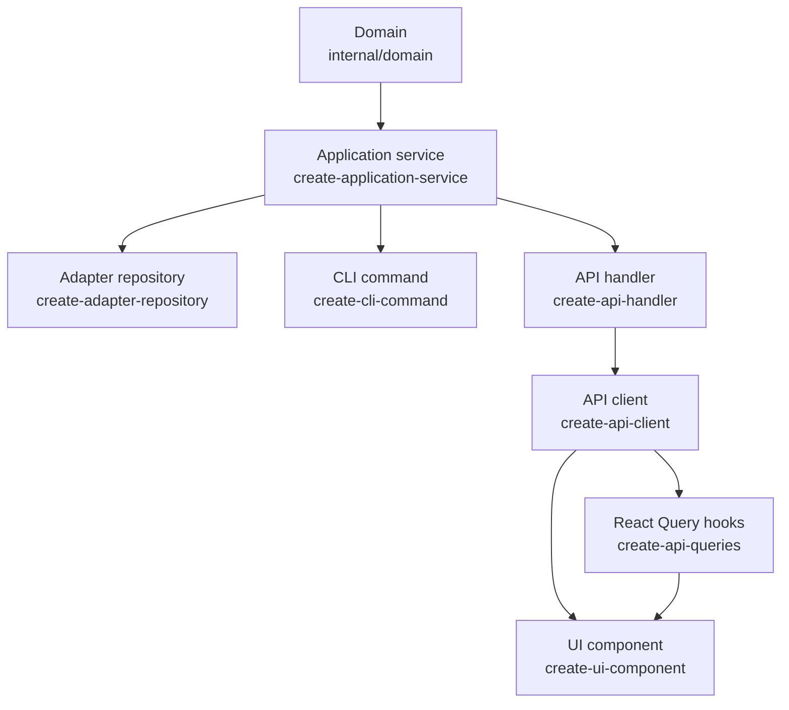

# Skill layer order

Skills map to layers in the hexagonal stack. **Upstream code must exist and be implemented** (not `not implemented` stubs) before starting work in a downstream skill.

This is a **code dependency order**, not the order you must invoke skills. CLI and HTTP handler are siblings — both depend on application service only.

## Stack

| Layer | Skill | Requires upstream |
|-------|-------|-------------------|
| Application service | `create-application-service` | Domain command/API for write paths |
| Adapter repository | `create-adapter-repository` | Application port + service struct |
| CLI command | `create-cli-command` | Application service method (implemented) |
| API handler | `create-api-handler` | Application service method (implemented) |
| API client | `create-api-client` | API handler + route + `api-types` |
| React Query hooks | `create-api-queries` | Client function in `{resource}-client.ts` |
| UI component | `create-ui-component` | Existing props/DTOs; new writes → client function; new reads → query hook |

Adapter and CLI/handler are **not** prerequisites for each other. Handler tests use stub repositories; CLI tests use stub repositories. Adapter is required for production/bootstrap wiring but not for handler or CLI skills. Presentational UI on existing props does not require new query hooks. Page **writes** (complete, delete) call the client and `invalidateQueries` — they do **not** require a mutation hook.

## Stop rule

When upstream code is missing or still a stub:

1. **Stop immediately** — do not write failing tests or production code for the downstream layer.
2. **Tell the user** which upstream layer and skill to complete first.
3. **Offer** to switch to the upstream skill if the user wants to continue in the same session.

## Verification checklist

Run these checks by reading the codebase before starting downstream work.

### Application service (`create-application-service`)

| Check | How to verify |
|-------|---------------|
| Domain command exists (writes) | `domain.{Command}(...)` defined in `internal/domain/` |
| Domain feature passes (writes) | Godog scenarios green for the command |

### Adapter repository (`create-adapter-repository`)

| Check | How to verify |
|-------|---------------|
| Port interface exists | `{Aggregate}Repository` in `internal/application/{aggregate}_service.go` |
| Service struct exists | `{Aggregate}Service` + `New{Aggregate}Service` in same file |
| Port lists the methods to implement | Interface includes `Save`, `GetByID`, etc. as needed |

If missing → stop, use `create-application-service`.

### CLI command (`create-cli-command`)

| Check | How to verify |
|-------|---------------|
| Service method exists | `(s *{Service}) {Method}(...)` in `internal/application/` |
| Method is implemented | Body does not return `fmt.Errorf("not implemented")` |
| Application tests pass | `go test ./internal/application/...` green for that method |

If missing → stop, use `create-application-service`.

### API handler (`create-api-handler`)

| Check | How to verify |
|-------|---------------|
| Service method exists | `(s *{Service}) {Method}(...)` in `internal/application/` |
| Method is implemented | Body does not return `fmt.Errorf("not implemented")` |
| Application tests pass | `go test ./internal/application/...` green for that method |

If missing → stop, use `create-application-service`.

### API client (`create-api-client`)

| Check | How to verify |
|-------|---------------|
| Handler exists | `handlers.{Handler}(...)` in `api/cmd/server/handlers/` |
| Route registered | Matching `mux.HandleFunc(...)` in `api/cmd/server/server.go` |
| Response type in api-types | e.g. `ListResponse` in `api-types/index.ts` |
| Request type in api-types (writes) | e.g. `CreateListRequest` in `api-types/index.ts` |
| Types current | `make api-types` run after last DTO change |

If handler missing → stop, use `create-api-handler`.
If types missing → stop, use `create-api-handler` (DTOs + `make api-types`).

### React Query hooks (`create-api-queries`)

| Check | How to verify |
|-------|---------------|
| Client function exists | `{verb}{Resource}(...)` in `ui/src/lib/api/{resource}-client.ts` |
| Client test passes | `npm test -- src/lib/api/{resource}-client.spec.ts` green |

If client function missing → stop, use `create-api-client`.

### UI component (`create-ui-component`)

| Check | How to verify |
|-------|---------------|
| New write? | Client `{verb}{Resource}` in `ui/src/lib/api/{resource}-client.ts` |
| New read the page does not already query? | Hook in `ui/src/lib/api/{resource}-queries.ts` |
| Mutation hook? | **Not required.** Pages call the client then `invalidateQueries` (see `ListPage` complete/delete). |

If the UI only uses existing DTOs/callbacks (hover chrome, dropdown open/close) → proceed.
If it needs a new write and the **client** is missing → stop, use `create-api-client`.
If it needs a new **read** and no query hook exists → stop, use `create-api-queries`.
If the client exists for a write → **proceed**. Do not stop for a missing `use{Action}{Resource}Mutation`.

## Full vertical slice order

When building end to end, work in this order:

1. Domain (Gherkin + godog)
2. Application service (`create-application-service`)
3. Adapter repository (`create-adapter-repository`) — for persistence
4. Bootstrap wiring (no skill yet) — connect adapter to service in `main.go`
5. API handler **or** CLI command (`create-api-handler` / `create-cli-command`)
6. `make api-types` (after handler DTOs)
7. API client (`create-api-client`)
8. React Query hooks (`create-api-queries`) — **new reads** only; skip when the page already has a query key to invalidate after a write
9. UI components / pages (`create-ui-component`)
