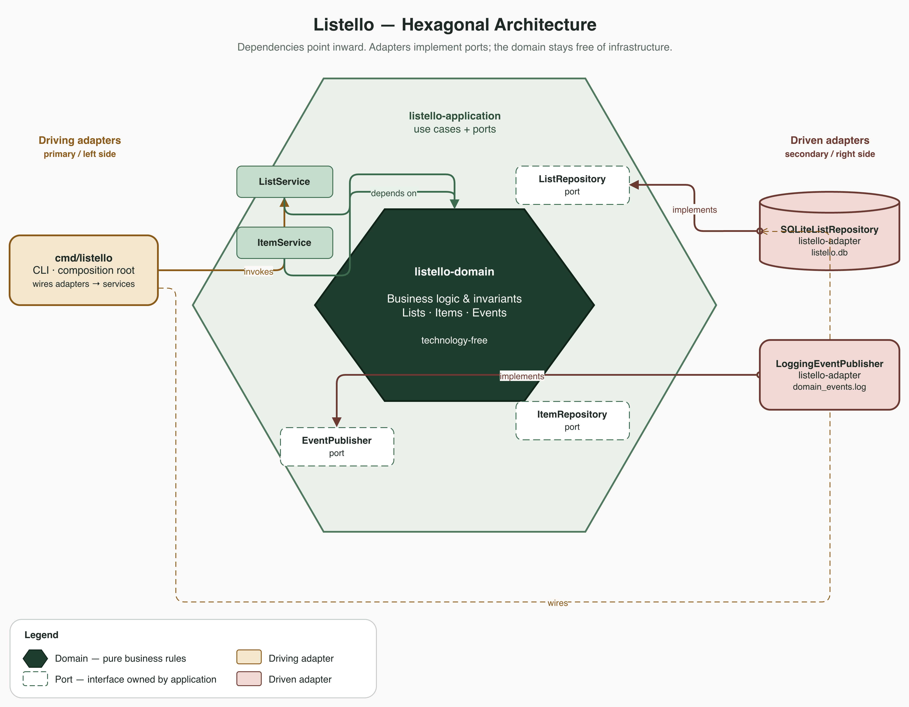
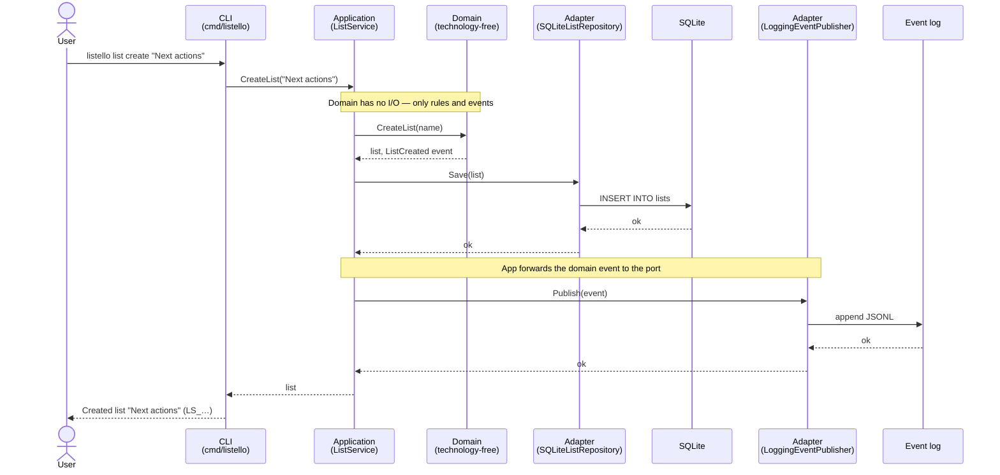

# Listello

Listello is a personal task-list system in the spirit of Getting Things Done: capture work into an inbox, refine it, define items on lists, and complete them. Domain behavior is expressed as commands that raise typed domain events.

## Architecture

The codebase follows a hexagonal (ports & adapters) layout. Dependencies point inward toward the domain.



```
api/
  cmd/listello          → composition root (CLI + HTTP server; wires adapters into application services)
  internal/
    listello-domain     → business logic and invariants; free of infrastructure
    listello-application→ use cases; defines ports (repositories, EventPublisher)
    listello-adapter    → port implementations (SQLite, file event log)
ui/                     → React app; calls api over HTTP (Vite dev proxy in local dev)
```

**Domain** is the technology-free core: business logic, invariants, and domain concepts (lists, items, events, and whatever else the model needs). Commands raise typed domain events with structured `EventMetadata*` payloads. No I/O, frameworks, or persistence concerns live here.

**Application** coordinates a command: call the domain, persist via a repository port, publish the event via `EventPublisher`. It depends only on domain types and its own interfaces.

**Adapter** implements those ports (SQLite for lists today; a logging publisher for events) and is the only layer that talks to the outside world.

**Composition** lives in `api/cmd/listello`: open SQLite and the event log, construct adapter implementations, inject them into application services. The `serve` subcommand exposes the same services over HTTP (`GET /health`, `POST /api/lists`).

### Command flow: `listello list create`



The domain never touches the database or the event log. It returns a value object plus a typed event; the application layer is responsible for persisting the aggregate through a repository port and publishing that event through `EventPublisher`. Only adapters know about SQLite and the file log.

## Testing

- **Domain** — Gherkin features + Godog (`internal/listello-domain/features`), developed with TDD.
- **Application / adapters** — Go unit tests with fakes/mocks at the ports (arrange/act/assert, not Gherkin).

### Domain TDD

1. **Red** — Write or extend a `.feature` scenario and wire Godog steps to the real domain API. Confirm the failure is missing behavior, not a broken harness.
2. **Review** — Stop. Specs are approved before production code changes.
3. **Green** — Implement the bare minimum domain logic to pass. Refactor only while staying green.

### Example feature

```gherkin
Feature: Define and complete a list item
  As a user
  I want to define an item on a list and complete that item
  So that I can track work from empty list through to done

  Scenario: Defining an item on a list
    Given a list named "Next actions" exists
    When the user defines an item titled "Buy milk" on the list "Next actions"
    Then a "ItemDefined" event should have occurred
    And the item "Buy milk" should be on the list "Next actions"
    And the item "Buy milk" should be outstanding

  Scenario: Defining an item on the inbox fails
    Given an inbox list exists
    When the user defines an item titled "Buy milk" on the list "Inbox"
    Then defining the item should fail with error "can only capture items on inbox lists, not define them"
```
