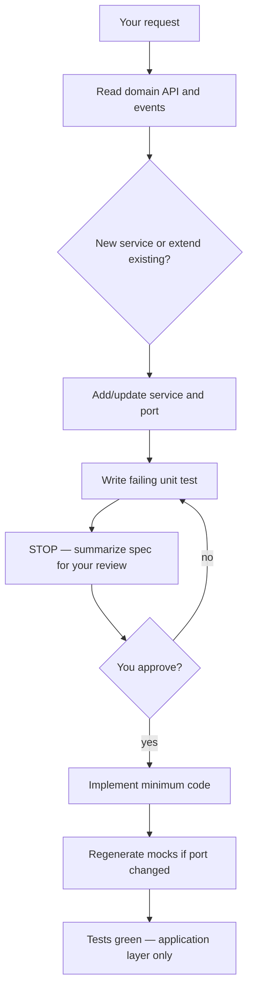

# AI Tooling

This repo includes Cursor configuration that guides agents working on Listello: an always-on TDD rule and project skills for common workflows.

## Layout

```
.cursor/
├── rules/
│   └── tdd.mdc                              # Always applied
└── skills/
    └── create-application-service/
        ├── SKILL.md                         # Main workflow
        └── examples.md                      # Annotated ListService / ItemService
```

## Always-on rules

### TDD (`.cursor/rules/tdd.mdc`)

Applied to every agent session. When adding or changing behavior:

1. **Red** — Write the failing spec first (Gherkin + godog in `internal/domain`; Go unit tests elsewhere). Confirm the failure is missing behavior, not a broken harness.
2. **Stop** — Summarize the spec and failure. Do not implement until you approve.
3. **Green** — Implement the bare minimum to pass. Re-run tests.

Agents must not ship production code in the same turn as a new failing spec.

## Project skills

Skills are markdown playbooks the agent reads when a task matches. They live in `.cursor/skills/` and travel with the repo.

### `create-application-service`

Scaffolds and implements use cases in `api/internal/application/`: repository ports, service struct, unit tests, and mockery regeneration.

**In scope:** `{aggregate}_service.go`, `{aggregate}_service_test.go`, port interfaces, `api/.mockery.yml`, `make -C api mocks`.

**Out of scope** (unless you ask separately): adapters, bootstrap wiring, HTTP handlers, CLI commands.

Architecture context: [README.md](../README.md). Skill details: [.cursor/skills/create-application-service/SKILL.md](../.cursor/skills/create-application-service/SKILL.md).

#### How to invoke

| Mode | What to say |
|------|-------------|
| **Explicit** | `@create-application-service` or *"use the create-application-service skill"* |
| **Auto-discover** | Describe the task — e.g. *"Add CompleteItem to ItemService"* or *"Scaffold DefineItem in the application layer"* |

Example prompts:

- *"Add a `CompleteItem` method to ItemService"*
- *"Create an application service for capturing items"*
- *"@create-application-service add GetByID to ItemRepository"*

#### What the agent will do



For **write commands**, the service calls domain → `repository.Save` → `eventPublisher.Publish`. For **reads**, it delegates to the repository only.

After tests pass, the agent may mention follow-ups (adapter, bootstrap, handlers) but will not implement them unless you ask.

#### Reference implementation

See [.cursor/skills/create-application-service/examples.md](../.cursor/skills/create-application-service/examples.md) for annotated `ListService` and `ItemService` patterns.

## Adding more skills

Follow the same structure:

1. Create `.cursor/skills/<skill-name>/SKILL.md` with YAML frontmatter (`name`, `description`).
2. Use a third-person `description` with trigger terms so agents can auto-discover the skill.
3. Omit `disable-model-invocation` if you want both explicit `@mention` and auto-discovery.
4. Keep `SKILL.md` concise; put detailed examples in a sibling file if needed.
5. Document the skill in this file.

## Tips for working with agents

- **Approve red before green** — The TDD rule requires a stop after failing specs. Say *"approved, implement"* when you're ready for production code.
- **Scope requests** — The application-service skill stops at `internal/application`. Name other layers explicitly if you want them in the same task.
- **Reload if needed** — After adding or changing skills, start a new chat or reload the window so Cursor picks up new project skills.
