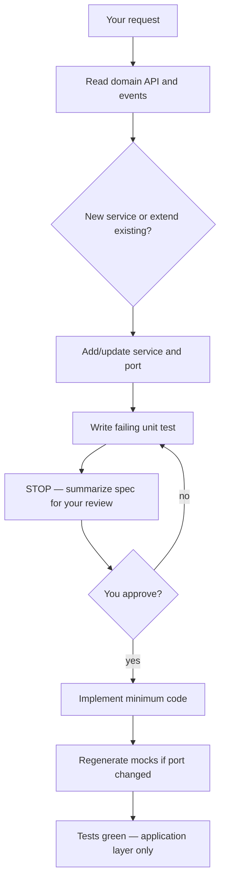
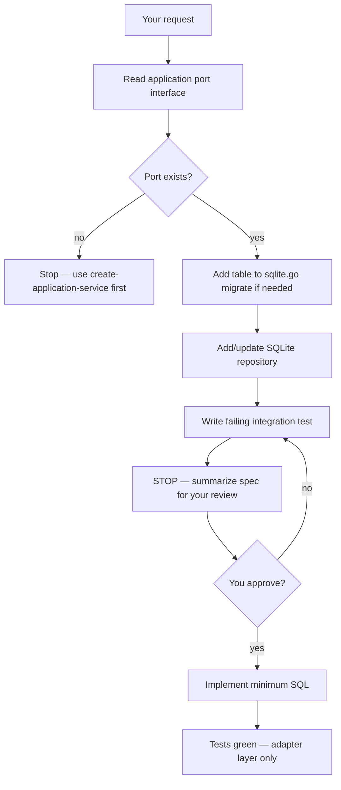
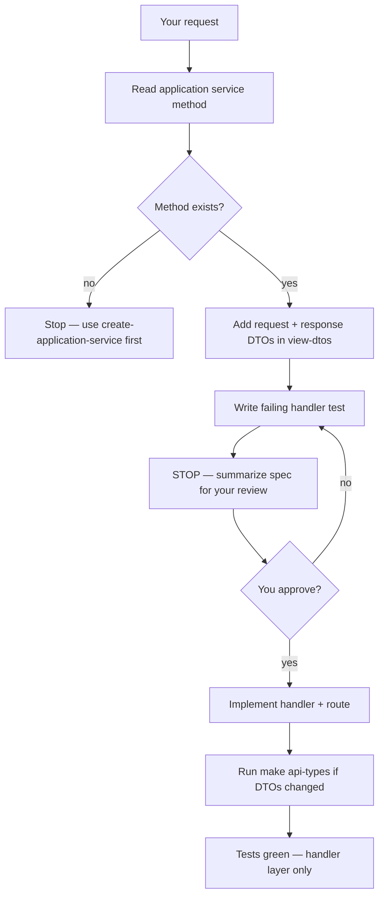
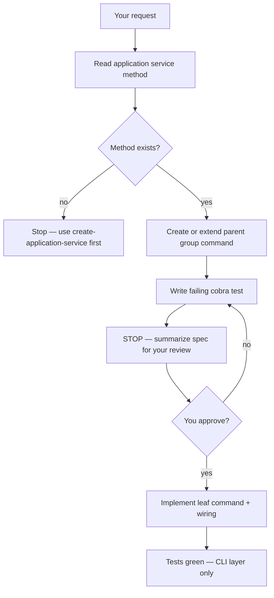

# AI Tooling

This repo includes Cursor configuration that guides agents working on Listello: an always-on TDD rule and project skills for common workflows.

## Layout

```
.cursor/
├── rules/
│   └── tdd.mdc                              # Always applied
└── skills/
    ├── create-application-service/
    │   ├── SKILL.md                         # Application-layer use cases
    │   └── examples.md
    ├── create-adapter-repository/
    │   ├── SKILL.md                         # SQLite repository adapters
    │   └── examples.md
    ├── create-api-handler/
    │   ├── SKILL.md                         # HTTP handlers and routes
    │   └── examples.md
    └── create-cli-command/
        ├── SKILL.md                         # Cobra CLI commands
        └── examples.md
```

## Always-on rules

### TDD (`.cursor/rules/tdd.mdc`)

Applied to every agent session. When adding or changing behavior:

1. **Red** — Write the failing spec first (Gherkin + godog in `internal/domain`; Go unit tests elsewhere). Confirm the failure is missing behavior, not a broken harness.
2. **Stop** — Summarize the spec and failure. Do not implement until you approve.
3. **Green** — Implement the bare minimum to pass. Re-run tests.

Agents must not ship production code in the same turn as a new failing spec.

## Project skills

Skills are markdown playbooks the agent reads when a task matches. They live in `.cursor/skills/` and travel with the repo.

### `create-application-service`

Scaffolds and implements use cases in `api/internal/application/`: repository ports, service struct, unit tests, and mockery regeneration.

**In scope:** `{aggregate}_service.go`, `{aggregate}_service_test.go`, port interfaces, `api/.mockery.yml`, `make -C api mocks`.

**Out of scope** (unless you ask separately): adapters, bootstrap wiring, HTTP handlers, CLI commands.

Architecture context: [README.md](../README.md). Skill details: [.cursor/skills/create-application-service/SKILL.md](../.cursor/skills/create-application-service/SKILL.md).

#### How to invoke

| Mode | What to say |
|------|-------------|
| **Explicit** | `@create-application-service` or *"use the create-application-service skill"* |
| **Auto-discover** | Describe the task — e.g. *"Add CompleteItem to ItemService"* or *"Scaffold DefineItem in the application layer"* |

Example prompts:

- *"Add a `CompleteItem` method to ItemService"*
- *"Create an application service for capturing items"*
- *"@create-application-service add GetByID to ItemRepository"*

#### What the agent will do



For **write commands**, the service calls domain → `repository.Save` → `eventPublisher.Publish`. For **reads**, it delegates to the repository only.

After tests pass, the agent may mention follow-ups (adapter, bootstrap, handlers) but will not implement them unless you ask.

#### Reference implementation

See [.cursor/skills/create-application-service/examples.md](../.cursor/skills/create-application-service/examples.md) for annotated `ListService` and `ItemService` patterns.

### `create-adapter-repository`

Implements application repository ports in `api/internal/adapter/` with SQLite: `SQLite{Aggregate}Repository`, SQL queries, schema in `sqlite.go`, and integration tests against a real temp database.

**In scope:** `{aggregate}_repository.go`, `{aggregate}_repository_test.go`, `CREATE TABLE` additions in `sqlite.go`.

**Out of scope** (unless you ask separately): application port definitions, bootstrap wiring, HTTP handlers, CLI commands.

**Prerequisite:** the application port must exist first — use `create-application-service` if it does not.

Skill details: [.cursor/skills/create-adapter-repository/SKILL.md](../.cursor/skills/create-adapter-repository/SKILL.md).

#### How to invoke

| Mode | What to say |
|------|-------------|
| **Explicit** | `@create-adapter-repository` or *"use the create-adapter-repository skill"* |
| **Auto-discover** | Describe the task — e.g. *"Implement SQLiteItemRepository"* or *"Add GetByID to the list adapter"* |

Example prompts:

- *"Implement SQLiteItemRepository for the ItemRepository port"*
- *"Add an items table and adapter Save method"*
- *"@create-adapter-repository add GetByID to SQLiteListRepository"*

#### What the agent will do



Tests use real SQLite via `adapter.OpenSQLite` and `t.TempDir()` — no mocks.

After tests pass, the agent may mention bootstrap wiring as a follow-up but will not implement it unless you ask.

#### Reference implementation

See [.cursor/skills/create-adapter-repository/examples.md](../.cursor/skills/create-adapter-repository/examples.md) for annotated `SQLiteListRepository` patterns.

### `create-api-handler`

Wires HTTP endpoints in `api/cmd/server/`: handler function, `httptest` tests, route registration in `server.go`, and **request + response DTOs** in `view-dtos/`.

**In scope:** `handlers/{action}_{resource}.go`, handler tests, `server.go` routes, `{Action}{Resource}Request` + `{Resource}Response` DTOs, DTO tests, `make api-types`.

**Out of scope** (unless you ask separately): application services, adapters, bootstrap/`main.go`, UI client, Bruno.

**Prerequisite:** the application service method must exist — use `create-application-service` if it does not.

Skill details: [.cursor/skills/create-api-handler/SKILL.md](../.cursor/skills/create-api-handler/SKILL.md).

#### How to invoke

| Mode | What to say |
|------|-------------|
| **Explicit** | `@create-api-handler` or *"use the create-api-handler skill"* |
| **Auto-discover** | Describe the task — e.g. *"Add POST /api/lists/{id}/items"* or *"Wire up DefineItem as an HTTP endpoint"* |

Example prompts:

- *"Add an API endpoint for DefineItem"*
- *"Wire POST /api/lists to CreateList"*
- *"@create-api-handler add GET /api/lists/{id}"*

#### What the agent will do



Handlers decode JSON into request DTOs, call application services, map results to response DTOs, and use `response.WriteJSON` / `WriteError`. Run `make api-types` after DTO changes.

After tests pass, the agent may mention `main.go` bootstrap wiring as a follow-up but will not implement it unless you ask.

#### Reference implementation

See [.cursor/skills/create-api-handler/examples.md](../.cursor/skills/create-api-handler/examples.md) for annotated `CreateList`, `GetList`, and `GetAllLists` patterns.

### `create-cli-command`

Wires Cobra commands in `api/cmd/cli/`: leaf command factory, parent group, `cobra.Execute` tests, and registration in `root.go`.

**In scope:** `commands/{resource}.go`, `commands/{resource}_{action}.go`, command tests, `root.go` wiring.

**Out of scope** (unless you ask separately): application services, adapters, bootstrap/`main.go`, HTTP handlers, view DTOs.

**Prerequisite:** the application service method must exist — use `create-application-service` if it does not.

CLI design reference: [listello-cli-design.md](../listello-cli-design.md). Skill details: [.cursor/skills/create-cli-command/SKILL.md](../.cursor/skills/create-cli-command/SKILL.md).

#### How to invoke

| Mode | What to say |
|------|-------------|
| **Explicit** | `@create-cli-command` or *"use the create-cli-command skill"* |
| **Auto-discover** | Describe the task — e.g. *"Add listello item define command"* or *"Wire up DefineItem as a CLI command"* |

Example prompts:

- *"Add a CLI command for DefineItem"*
- *"Wire listello list create"*
- *"@create-cli-command add item define"*

#### What the agent will do



Commands call application services via `RunE`, print one-line confirmations to stdout, and return errors for non-zero exit. Tests use `SetArgs` with stub repositories.

After tests pass, the agent may mention `main.go` bootstrap wiring as a follow-up but will not implement it unless you ask.

#### Reference implementation

See [.cursor/skills/create-cli-command/examples.md](../.cursor/skills/create-cli-command/examples.md) for annotated `list create` patterns.

## Adding more skills

Follow the same structure:

1. Create `.cursor/skills/<skill-name>/SKILL.md` with YAML frontmatter (`name`, `description`).
2. Use a third-person `description` with trigger terms so agents can auto-discover the skill.
3. Omit `disable-model-invocation` if you want both explicit `@mention` and auto-discovery.
4. Keep `SKILL.md` concise; put detailed examples in a sibling file if needed.
5. Document the skill in this file.

## Tips for working with agents

- **Approve red before green** — The TDD rule requires a stop after failing specs. Say *"approved, implement"* when you're ready for production code.
- **Scope requests** — Application and adapter skills stop at their layer. Name bootstrap, handlers, or CLI explicitly if you want them in the same task.
- **Layer order** — For a full vertical slice: domain → application → adapter → bootstrap → handlers/CLI → UI client.
- **Reload if needed** — After adding or changing skills, start a new chat or reload the window so Cursor picks up new project skills.
