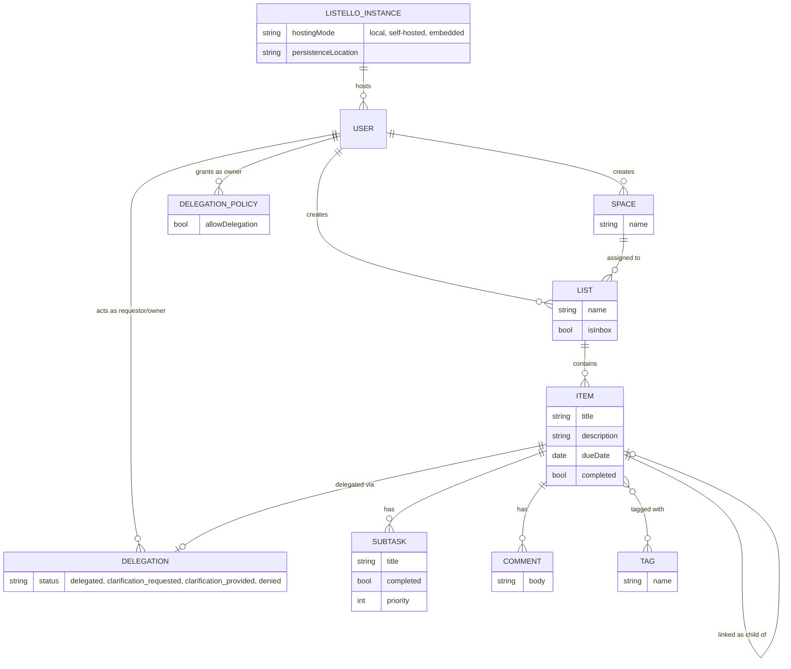

# Listello Domain Model

Derived from event storming sessions covering Instance Management, Personal Productivity (Spaces/Lists/Items), and Item Delegation.

## Entity Relationship Diagram

## Aggregates, Entities, and Command/Event Pairs

### Listello Instance
**Entities:** none additional (instance itself holds config)

| Actor | Command | Event |
|---|---|---|
| User | Create Instance | Instance Created |
| User | Select Hosting Mode | Hosting Mode Selected |
| User | Select Persistence Location | Local Persistence Location Selected |
| System | Initialize Local Persistence | Local Persistence Initialized |
| System | Initialize Persistence | Persistence Initialized |
| User | Complete Setup | Setup Completed |

### User
**Entities:** none additional

| Actor | Command | Event |
|---|---|---|
| User | Create User | User Created |

### Space
**Entities:** none additional

| Actor | Command | Event |
|---|---|---|
| User | Create Space | Space Created |
| System | Assign Space to User | Space Assigned to User |

### List
**Entities:** none additional

| Actor | Command | Event |
|---|---|---|
| System | Create Inbox | Inbox Created |
| User | Create List *(command already exists — reused)* | First List Created |
| User | Create List | List Created |
| User | Delete List | List Deleted |

### Item
**Entities:** Tag, Due Date (value objects on Item)

| Actor | Command | Event |
|---|---|---|
| User | Capture Inbox Item | Item Captured |
| User | Define Item | Item Defined |
| Owner | Modify Item Description | Item Description Changed |
| Owner | Modify Item Title | Item Title Changed |
| Requestor/Owner | Modify Due Date | Due Date Added to Item |
| Requestor/Owner | Remove Due Date | Due Date Removed from Item |
| Owner | Tag | Tag Added to Item |
| Owner | Untag | Tag Removed from Item |
| Owner | LinkAsChild | Item Linked as Child of Item |
| Owner | Move Item | Item Moved to Other List |
| Requestor/Owner | CompleteItem | Item Completed |
| Requestor/Owner | UncompleteItem | Item Uncompleted |
| Requestor/Owner | DeleteItem | Item Deleted |

### Subtask
**Entities:** Subtask (child entity of Item)

| Actor | Command | Event |
|---|---|---|
| Owner | Subtask | Subtask Added to Item |
| Owner | Complete Subtask | Subtask Completed on Item |
| Owner | Uncomplete Subtask | Subtask Uncompleted |
| Owner | Delete Subtask | Subtask Deleted on Item |
| Owner | Prioritize | Subtask Priority Changed |

### Comment
**Entities:** Comment (child entity of Item)

| Actor | Command | Event |
|---|---|---|
| User | Comment | Item Commented On |
| User | Delete Comment | Item Comment Deleted |

### Delegation Policy
**Entities:** none additional

| Actor | Command | Event |
|---|---|---|
| Owner | Allow Delegation | Delegation Permission Granted to Other Person |

### Delegation
**Entities:** none additional

| Actor | Command | Event |
|---|---|---|
| Requestor | Delegate Item | Item Delegated |
| Owner | Request Clarification | Clarification Requested |
| Requestor | Provide Clarification | Clarification Provided |
| Owner | Deny Delegation | Delegation Permission Revoked from Other Person |

## Read Models / Views

No commands — projections only:

- List View
- Item View
- Item List
- Create Item View
- Comment View
- Delegation Policies View
- Create Delegation Policy View
- Delegated Items View
- Assigned to Me View
- Needs Clarification View

## Open Questions

- **"Prioritize"** sits visually in the Subtask column but its command name is generic — confirm it's actually a subtask-priority operation and not an Item-level prioritization.
- **"Defined item"** command name vs. **"Defined created"** event — likely meant to be "Item Defined" for consistency; flagging in case it's a typo on the sticky rather than an intentional naming choice.
- **Item ↔ Item** self-reference (LinkAsChild) is modeled as one-to-one — confirm whether an item should be allowed multiple children.
