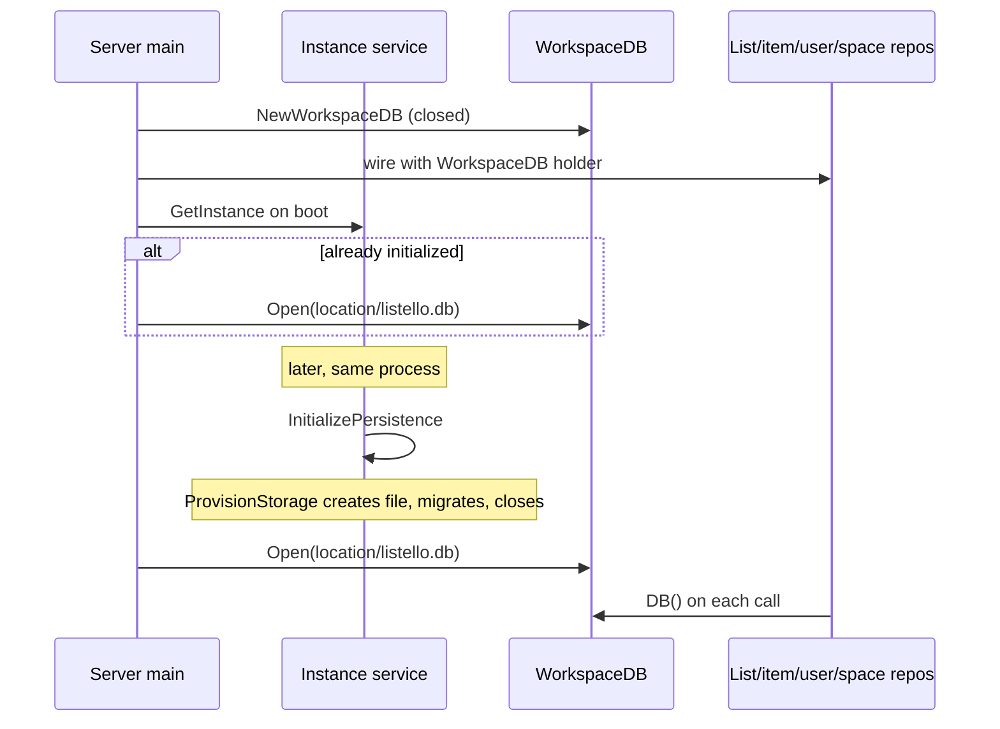

# Deferred workspace database

The HTTP server does not open the productivity SQLite database until Listello instance persistence is initialized. The process can start with no workspace file, then open `{persistence location}/listello.db` in-process after onboarding — no restart, channel, or event-bus subscription.

Instance setup (create instance, hosting mode, persistence location) does not need the workspace database. Lists, items, users, and spaces do.

## Why a holder instead of opening at boot

`FilesystemPersistenceAdapter.ProvisionStorage` creates `{location}/listello.db`, runs schema migrations, and **closes** that connection. The server still needs a **live** connection afterward for list/item/user/space work.

Opening a cwd `listello.db` at startup is the wrong path once the user chooses a persistence location. A channel or `PersistenceInitialized` listener would add a race: HTTP can hit list/item endpoints before open finishes, and it would couple composition to the event log.

Opening **synchronously** in the composition root — on boot if already initialized, and immediately after `InitializePersistence` succeeds — means the client that just finished onboarding can use list APIs on the next request.

## `WorkspaceDB`

[`api/internal/sqlite/workspace_db.go`](../api/internal/sqlite/workspace_db.go) is a process-wide holder around the SQLite connection used for workspace data.

| Method | Behavior |
|--------|----------|
| `NewWorkspaceDB()` | Starts closed (`db == nil`) |
| `Open(path)` | Opens via `sqlite.OpenSQLite` (create + migrate), replaces any previous handle (closes the old one first) |
| `DB()` | Returns `*sql.DB`, or error `"persistence not initialized"` when closed |
| `Close()` | Closes the underlying database if open; closing when already closed is a no-op |

Internally it holds `*sqlite.SQLite` (not `*sql.DB`). `DB()` unwraps that to `*sql.DB`. Access is guarded by an `RWMutex` so boot, `InitializePersistence`, and repository calls cannot race on the handle.

`Open` is safe to call more than once (reopen / replace). Tests cover closed `DB()`, open-then-`DB()`, replace-previous-handle, and close.

## Repositories resolve the connection per call

SQLite repositories hold `*sqlite.WorkspaceDB`, not a live `*sql.DB`. At the start of each method they call `r.workspace.DB()`.

This applies to all workspace-data adapters:

- `SQLiteListRepository`
- `SQLiteItemRepository`
- `SQLiteUserRepository`
- `SQLiteSpaceRepository`

There is no separate `DBProvider` interface; constructors take `*sqlite.WorkspaceDB` directly.

Bootstrap constructors in [`api/internal/bootstrap/bootstrap.go`](../api/internal/bootstrap/bootstrap.go) (`NewListService`, `NewItemService`, `NewUserService`, `NewSpaceService`) take the same holder.

Adapter tests open a real temp database with `WorkspaceDB.Open` in arrange. Behavior when open is unchanged.

If a list/item/user/space request arrives while the holder is still closed, the repository error wraps `"persistence not initialized"`. There is no dedicated HTTP middleware: existing handlers surface that error as they would any other repository failure (for example `GET /api/lists` returns 500; `POST /api/lists` returns 400).

## Server composition

[`api/cmd/server/main.go`](../api/cmd/server/main.go) does **not** call `MustOpenDB` at startup.

1. Create a closed `WorkspaceDB` and `defer workspace.Close()`.
2. Wire list, item, user, and space services with that holder.
3. Wrap the instance application service in `workspaceOpeningInstanceService`.
4. `GetInstance()`:
   - if an instance exists and `Persistence.IsInitialized()`, `Open(filepath.Join(location, "listello.db"))`
   - otherwise leave the holder closed and keep serving instance APIs
5. Listen for HTTP.

Opening after initialize is a composition-root decorator, not domain or application logic:

[`api/cmd/server/workspace_opening_instance_service.go`](../api/cmd/server/workspace_opening_instance_service.go) implements `ListelloInstanceService`. Most methods delegate. `InitializePersistence`:

1. Calls the inner service.
2. On success, opens `{instance.Persistence.Location}/listello.db` on the shared holder **before** returning to the HTTP client.
3. On inner failure, does not open.

`ListelloInstanceService.InitializePersistence` itself is unchanged: `ProvisionStorage` then domain init, persist, publish. Cross-context DB binding stays in composition.

### Two opens of the same file

These are sequential, not two live connections at once:

1. **Provision** — `FilesystemPersistenceAdapter.ProvisionStorage` creates the directory, calls `sqlite.OpenSQLite` on `{location}/listello.db` (schema migrate), then **closes**.
2. **Live handle** — composition `Open`s the same path so repositories can use it.

`OpenSQLite` runs `CREATE TABLE IF NOT EXISTS` migrations on every open, so the second open is idempotent.

## CLI (not deferred)

The CLI still opens immediately via `--db` (default `listello.db`) and `bootstrap.MustOpenDB`. `MustOpenDB` now returns `*sqlite.WorkspaceDB` rather than `*sql.DB`. Aligning the CLI with instance persistence location is out of scope for this design.

## What this is not

- No in-process channel or event-bus subscription for “DB is ready”.
- No HTTP middleware whose only job is “workspace closed”.
- Domain and instance application do not know about `WorkspaceDB`.
